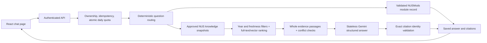

# NUSHub chatbot: implementation checkpoint — 4 October 2026

The chatbot UI and authenticated APIs are implemented and tested. Phase 5 is complete under the owner's 5 October agent-review and monthly-update policy: 32/32 live cases and 191 server tests passed, with all six official sources covered. See [completion evidence](knowledge/PHASE5_COMPLETION_2026-10-05.md) and [release policy](knowledge/PHASE5_RELEASE_POLICY.md). Expired sources remain unavailable; production readiness is Phase 6 work. Older evaluation figures below are historical checkpoints.

## Request flow



Modules use the structured NUSMods path. Campus knowledge uses retrieval augmented generation: select evidence first, then ask Gemini to answer from those passages. Ingestion adds searchable evidence; it does not train or fine-tune Gemini.

Source publication is a separate administrator workflow: registry allowlist → safe fetch → preview and approval → content-hash verification → chunking/embeddings → atomic immutable snapshot. Failed refreshes preserve the published version. Application users cannot invoke ingestion endpoints.

## Evidence boundaries

- Calendar questions request the academic year before retrieval. Missing regular semester context triggers clarification when relevant evidence exists. Unknown years cannot substitute a different calendar.
- Mini-semester questions fail closed while PDF table attribution remains unverified.
- Entire passages must fit the context budget. A truncated table row or exception is not passed off as a complete passage.
- Numeric differences survive near-duplicate removal. Declared conflicts are prioritized before document diversity limits and stop generation.
- Citation validation binds URLs, source/version identifiers, dates and chunk claim IDs to retrieved evidence.
- This validation does **not** establish semantic entailment. Human reviewers still check whether each cited passage supports every answer claim.
- Source previews blocked by access-control screens are never approved or ingested.

## Chat APIs

All routes below live under `/api/ai`, require a bearer token and use private/no-store responses. Resource queries include owner predicates. The service key and database URL stay on the server.

| Method and path | Behavior |
| --- | --- |
| GET /health | Safe configured/disabled status; no billable model call |
| GET /conversations | Latest 100 owned summaries |
| POST /conversations | Create a conversation; optional title, up to 80 characters |
| GET /conversations/:id | Latest 200 messages, with an explicit earlier-message flag |
| PATCH /conversations/:id | Rename an owned conversation |
| DELETE /conversations/:id | Delete conversation, messages, citations and feedback |
| POST /conversations/:id/messages | SSE exchange; requires Accept and Idempotency-Key headers |
| GET /messages/:id/evidence | Exact saved knowledge chunks referenced by an owned completed answer |
| POST /messages/:id/feedback | Helpful/unhelpful rating on an owned completed assistant message |

Repeating an exchange key and identical text replays the stored result without another quota charge or model call. The same key with different text returns 409. Daily quota increments atomically in PostgreSQL. Per-user concurrency is process-local; multi-instance coordination remains Phase 6 work.

The server retrieves and validates a complete answer before delivering text deltas. This is streamed delivery of a validated answer, **not** raw Gemini token streaming. SSE heartbeats keep idle connections active. Disconnect/Stop propagates cancellation to retrieval and Gemini; the route deadline also releases a stalled request slot and sends a terminal failure when the socket is available.

The client bounds event size, total output and event count, validates event data and order, rejects mixed request identifiers, and requires a terminal event. Incomplete text is visibly marked. Citation links permit official HTTPS NUS/NUSMods destinations only. Answer text and extracted passages render as text, without HTML execution.

## Interface

- Responsive chat workspace with topic starters, searchable recent history and mobile history access.
- Rename and destructive-delete dialogs with native keyboard/focus behavior.
- Expanding composer, Enter/Shift+Enter, IME composition handling, offline state and character limits.
- Stop works during both conversation creation and answer generation. A synchronous send guard prevents duplicate submissions.
- Scrolling stays where the reader leaves it; Jump to latest restores following.
- Source panels load exact saved passages on demand. Checked/effective dates and verification limitations stay visible.
- Copy includes source links; feedback has an in-flight guard.
- Reduced-motion support, visible focus states and scoped styling.
- The assistant route loads separately: approximately 33.6 kB JS / 10.4 kB gzip in the verified build.

## Local staging preview

The whole application uses the separate staging database, including staging-only users and chat history. This keeps source-version foreign keys and saved passages in the same database.

From `server/`:

```powershell
npm run dev:staging
```

From `client/`, in another terminal:

```powershell
$env:VITE_API_URL = 'http://127.0.0.1:5001'
npm run dev -- --host 127.0.0.1 --port 5178 --strictPort
```

Open http://127.0.0.1:5178/assistant and use a **staging account**. Normal application accounts are separate. Register a staging account through the local registration page if needed.

These are preview startup commands, not a claim that the preview is currently running. On 4 October Docker was recovered and the preserved database is healthy on port 55432. The live HTTP acceptance check used a temporary server and stopped it afterward; no preview was left on 5001/5178. See [the staging revalidation](knowledge/PHASE5_REVALIDATION_2026-10-04.md) for current observations and retained failures.

The launcher checks database separation and migration 012 before importing application modules, binds to loopback, uses a separate JWT issuer/audience, and clears normal object-storage and Google OAuth credentials. It generates an ephemeral staging JWT secret unless `STAGING_JWT_SECRET` is privately configured; otherwise sign in again after restarting. Ports/origin can be overridden with `STAGING_API_PORT` and `STAGING_CLIENT_URL`.

## Verification and remaining work

- Server: latest lint, 168 tests and TypeScript build passed, including a total provider deadline even when the SDK ignores cancellation, clarification before retrieval, and urgent guidance when retrieval fails.
- Client: lint, stream/URL contract tests and production build passed.
- Earlier real staging knowledge subset: 8/8, then 7/8 with a retained Gemini timeout. The expanded seventeen-case v3 draft was evaluated on an eleven-case subset twice: 9/11 with two timeouts, then 11/11. Source coverage and independent dataset/answer review remain pending; all failed runs are retained.
- Real PostgreSQL scenarios: stale evidence excluded, wrong year excluded, declared conflicts stop generation, rolled-back snapshot preserved.
- Live authenticated HTTP/SQL/Gemini API check: owned resources, clarification follow-up, cited passages, idempotency, quota, feedback, rename and deletion passed.
- Real Chromium acceptance uses explicit API fixtures: sending, source expansion, feedback, copying, rename, history search, mobile layout, Stop and delete dialogs passed. Screenshots and its report live under ignored `client/evaluation-results/assistant-ui/`.

Browser fixtures validate UI behavior, not model factual quality. Run `client/scripts/assistant-browser-check.mjs` with Playwright installed or `PLAYWRIGHT_MODULE_PATH` pointing to the bundled package. Start the loopback preview first.

On 4 October all five formerly blocked HTML sources were published in isolated staging through a user-authorized, hash-checked browser capture channel. The first complete 17-case draft run retrieved the expected official evidence for every positive case but passed only 12/17 automatic checks because five Gemini generations timed out. A later minimal-thinking run scored 8/17. The final full run against the current code also scored **8/17**: all nine generation-dependent cases timed out, while the cited self-harm template passed without generation. The authenticated HTTP check on the expanded corpus timed out and its synthetic account was removed. See [the full-corpus checkpoint](knowledge/PHASE5_FULL_CORPUS_2026-10-04.md).

Before Phase 6: obtain a continuously refreshable authorized official source channel; resolve provider reliability; complete independent case, contact and claim-level citation review; run the frozen full suite against the release thresholds. Then address multi-instance concurrency, process-crash recovery for unfinished messages, broader history pagination, load/failure testing, budgets, deployment rollback and limited beta.
